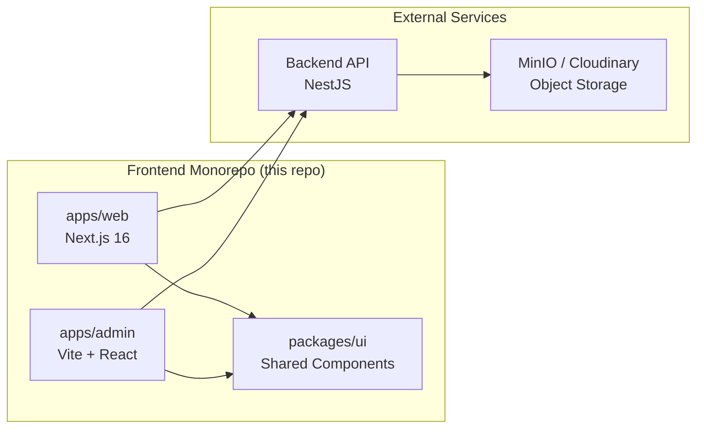
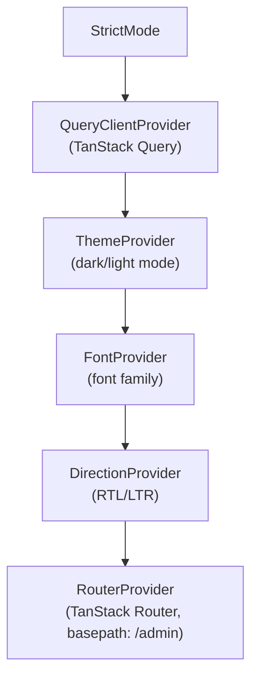
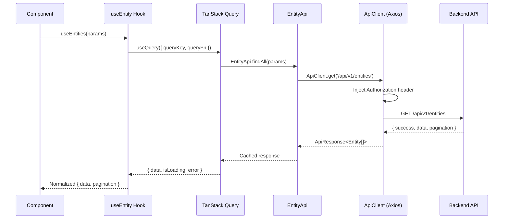
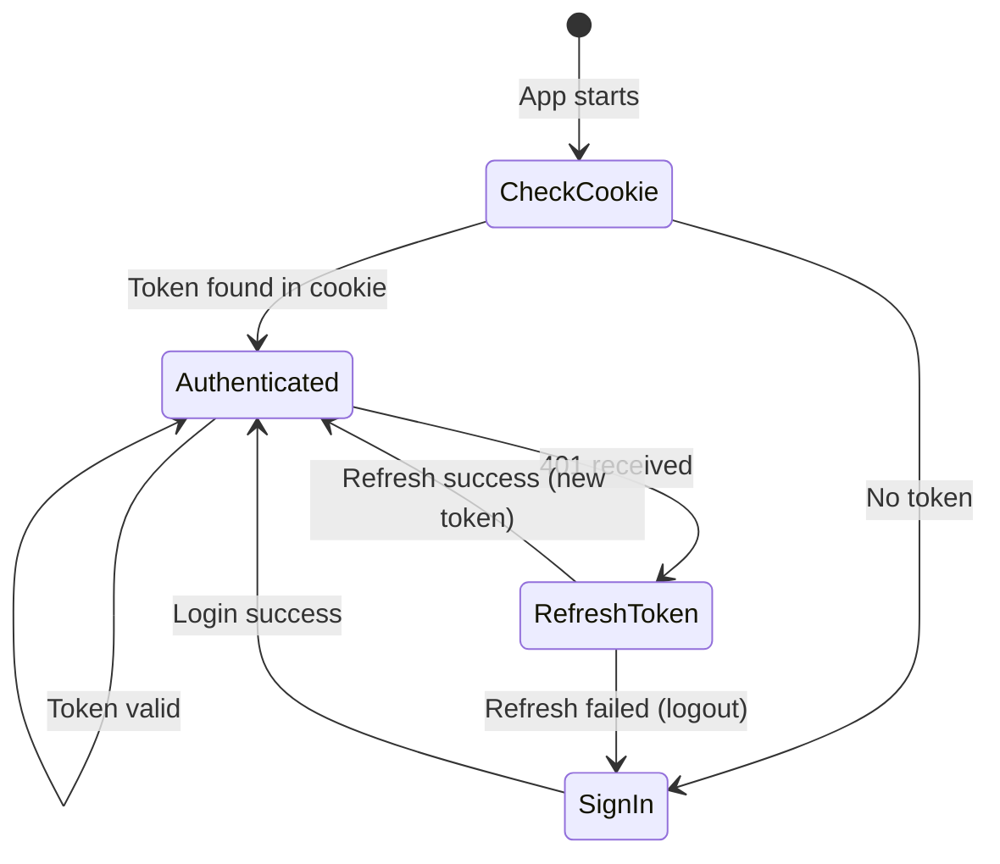
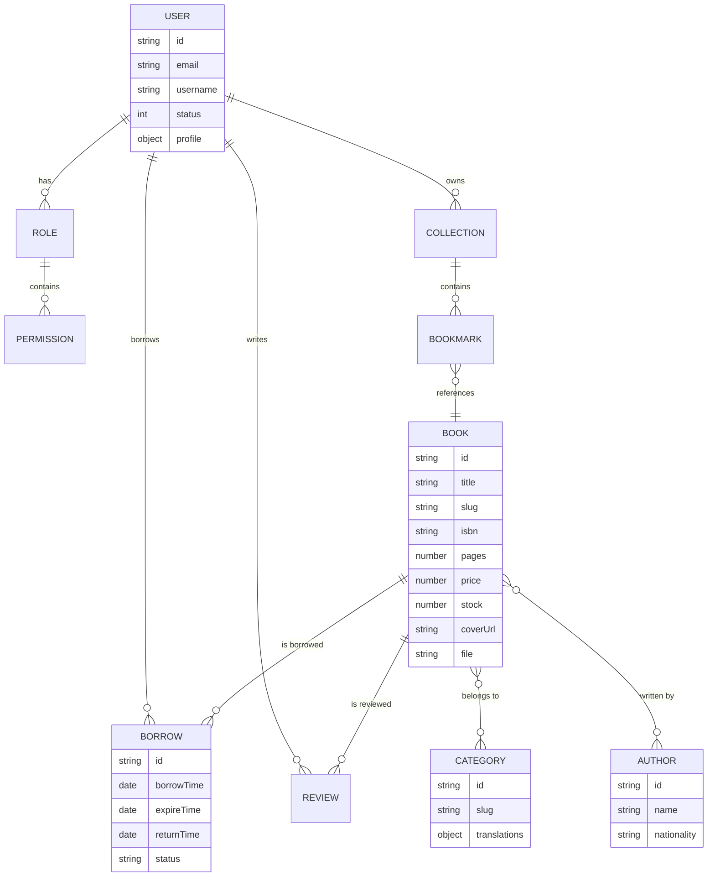
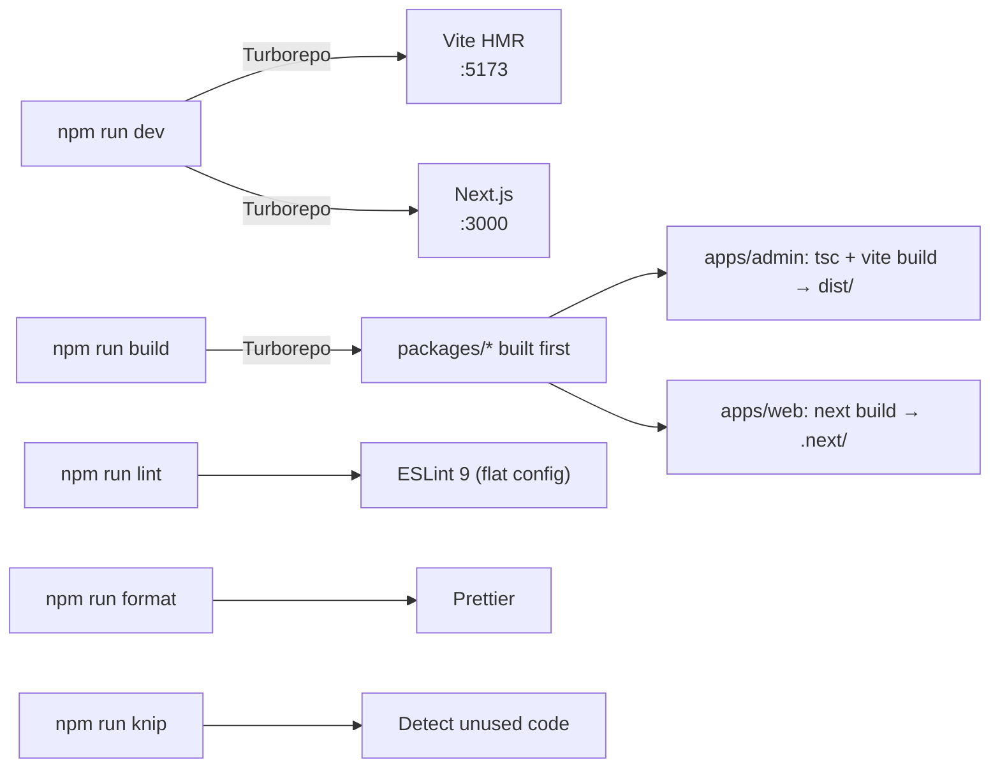

# iDoc Web — Architecture

> For tech stack and library versions, see [TECH_STACK.md](./TECH_STACK.md).  
> For coding conventions and patterns, see [RULES.md](./RULES.md).

## System Overview

iDoc is a **digital library management system**. This monorepo contains the **frontend** only.
The **backend** is a separate **NestJS** application that exposes a RESTful API.



---

## Monorepo Structure

```
idoc-web/                          # Root (Turborepo + npm workspaces)
├── apps/
│   ├── admin/                     # Admin dashboard (Vite + TanStack Router)
│   └── web/                       # Public website (Next.js 16 + App Router)
├── packages/
│   ├── ui/                        # Shared UI components (Radix + Tailwind)
│   ├── eslint-config/             # Shared ESLint 9 flat config
│   ├── tailwind-config/           # Shared TailwindCSS config
│   └── typescript-config/         # Shared TSConfig presets
├── turbo.json                     # Turborepo pipeline config
└── package.json                   # Root workspace config
```

---

## Admin App (`apps/admin`)

### Directory Structure

```
src/
├── apis/              # API services (*.api.ts) using ApiClient
│   └── config.ts      # ApiClient class (public/private modes, interceptors)
├── components/        # Shared layout & reusable components
│   ├── data-table/    # Generic data table (toolbar, pagination, faceted filter)
│   ├── form/          # Form components (date-picker, file-upload, image-upload)
│   └── layout/        # App shell, sidebar, header
├── config/            # App configuration (api, env, fonts, hotkeys, paths)
├── context/           # React contexts (theme, font, direction, layout, search)
├── features/          # ⭐ Feature modules (domain-driven, self-contained)
├── hooks/
│   ├── data/          # TanStack Query hooks per entity (useBook, useUser...)
│   └── ui/            # UI hooks (useDebounce, useDialogState, useTableUrlState...)
├── lib/               # Utility libraries (cookies, error handling, utils)
├── routes/            # TanStack Router file-based routes
├── stores/            # Zustand stores (auth-store.ts)
├── styles/            # Global styles
└── types/             # TypeScript types (enum.ts, request.ts, response.ts)
```

### Provider Tree



### Route Groups

```
src/routes/
├── __root.tsx                     # Root layout (Toaster, DevTools, error boundaries)
├── (auth)/                        # Public auth pages (no sidebar)
├── _authenticated/                # Protected routes (sidebar + header)
│   ├── route.tsx                  # Auth guard layout
│   ├── books/, users/, borrows/, categories/
│   ├── roles/, authors/, settings/, chats/
│   └── index.tsx                  # Dashboard
├── (errors)/                      # Error pages (403, 404, 500)
└── clerk/                         # OAuth callback routes
```

### Data Flow



### Auth Flow



Key components:

- **`stores/auth-store.ts`** — Zustand store managing user + tokens, persisted in cookies
- **`apis/config.ts`** — Axios interceptors auto-attach Bearer token and handle 401 refresh
- **`routes/_authenticated/route.tsx`** — Route guard redirecting unauthenticated users

### Environment Variables

Validated at startup via **Zod** in `src/config/env.ts`:

| Variable                | Purpose                    | Default                       |
| ----------------------- | -------------------------- | ----------------------------- |
| `VITE_MODE`             | dev/production             | `development`                 |
| `VITE_PORT`             | Dev server port            | `3001`                        |
| `VITE_BASE_URL`         | App base URL               | `http://localhost:3001/admin` |
| `VITE_API_URL`          | Backend API URL            | `http://localhost:8000/api`   |
| `VITE_API_KEY`          | API key header             | —                             |
| `VITE_TOKEN_COOKIE_KEY` | Cookie name for auth token | `authtoken`                   |
| `VITE_USER_COOKIE_KEY`  | Cookie name for user data  | `authuser`                    |

---

## Web App (`apps/web`)

### Directory Structure

```
src/
├── app/
│   ├── [locale]/      # Locale-based routing (vi, en)
│   │   ├── (main)/    # Main pages with navbar
│   │   ├── (auth)/    # Auth pages (sign-in, sign-up)
│   │   └── (error)/   # Error pages
│   ├── api/           # API routes (proxy to backend)
│   └── layout.tsx     # Root layout
├── actions/           # Server actions
├── apis/              # API client (same pattern as admin)
├── auth.ts            # next-auth configuration
├── components/        # Shared components
├── i18n.ts            # next-intl setup
├── middlewares/       # Next.js middlewares
└── proxy.ts           # API proxy config
```

---

## Shared UI (`packages/ui`)

- 50+ components built on **Radix UI** primitives
- Styled with **TailwindCSS 4**, variants via **CVA**
- `React.forwardRef` for all wrapper components
- `cn()` utility (`clsx` + `tailwind-merge`) for class merging
- Always prefer existing `@repo/ui` components before creating new ones

---

## Domain Model



---

## API Contract

All API calls return:

```typescript
interface ApiResponse<T> {
  success: boolean;
  status: number;
  message?: string;
  timestamp: string;
  data?: T;
  pagination?: { total: number; page: number; limit: number; pages: number };
}
```

Two ApiClient modes:

- **`'public'`** — No auth headers (registration, login)
- **`'private'`** (default) — Bearer token auto-attached, 401 auto-refresh

---

## Build Pipeline


